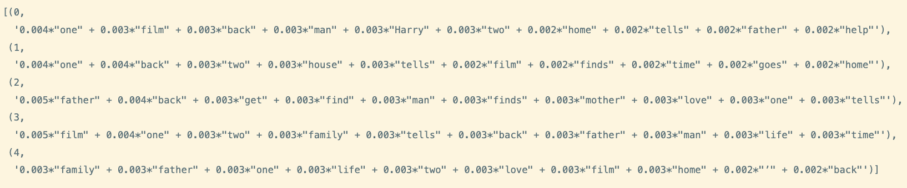
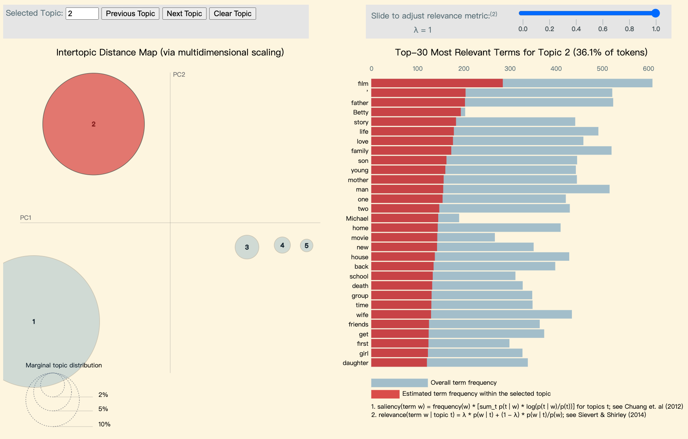

# Movie Company: How to increase the revenue?

| Student's name | SCIPER |
| -------------- | ------ |
|Yifei Song |335187 |
|Haoming Lin |351632 |
|Grave de Peralta Gonzalez Rolando  |?? |
|Ruiqi Yu |340546 |

## Abstract

The film industry market size can be up to two hundred billion USD every year, which is a big part of the economy, and proper data analysis can benefit its growth.
For investors, the level of box office is the criterion for the success of the movie, and the correct predictions of revenue help the better allocation of investment capital and higher income of the film industry.
Our goal is to study some factors related to film revenue and then use them to create a rough forecasting model for movie revenues, which will help potential investors have a better understanding of film revenue not only in the past but also in the future.

## Research Questions

- How do the factors(movie country, language, etc.) influence the film revenue?
- What is the expectation of a new movie revenue given some details?
- What are the hottest, or most recurring, topics in the film industry in the past decades?
- How will the trend of the film industry change in the coming period?

## Proposed additional datasets

- [Name Corpus](https://www.kaggle.com/datasets/nltkdata/names?resource=download) - a dataset containing male and female names, which is used to handle plot summary topic analysis tasks.

## Methods

### Data Pre-processing

#### Revenue Processing

We take into account that income is not the same as an indicator such as a score, but its value fluctuates depending on the era, country and special events, which means that economic activities such as inflation have to be taken into account. Therefore, we created a new column "Revenue_ratio", which represents the percentage of a movie's revenue in the total box office revenue of the year. This can reduce the difference in revenue due to inflation to a certain extent.

#### Plot Summary Processing

We treat all the plot summary data as a two-dimensional list, and the plot summary of each movie is a list on the second dimension.

To extract the topic of the movie through the analysis of the movie plot summary, we do the following processing of the movie plot summaries:

- Tokenization - Split the plot summary into the smallest unit of word, "token".
- Stopwords - Remove punctuation symbols, special characters and common words.
- Name Removing - Remove all common English names in our plot summary by using the additional dataset \<Name Corpus\>.
- Dictionary and corpus creation - Create word dictionary with our filtered tokens and create corpus by using [TF-IDF](https://fr.wikipedia.org/wiki/TF-IDF#:~:text=Le%20TF%2DIDF%20(de%20l,dans%20la%20fouille%20de%20textes)).

### Hottest Word in Movie Title

We would like to know which words appear in high frequency in all the movie names. This can reflect the trend of movie naming and the underlying movie topic.

<u>In further research, we will also examine whether the naming style of the films changed from period to period.</u>

#### Preliminary result:

We make a **wordcloud** with all movie names, which indicates the hottest words.

### Topic Retrieval

Since the plot summary is an unlabeled dataset, we decide to use **LDA**, an unsupervised learning algorithm, to implement topic retrieval and analysis. 

#### LDA Detail

LDA(Latent Dirichlet allocation) is to find topics a document belongs to, based on the pre-processed words in it:

- Go through each document and randomly assign each word in the document to one of $k$ topics ($k$ is chosen beforehand).

- For each document $d$, go through each word $w$ and compute :

  - $P(t|d)$ : the proportion of words in document $d$ that are assigned to topic $t$.

  - $P(w|t$) : the proportion of assignments to topic *t* over all documents that come from this word *w*. Tries to capture how many documents are in topic $t$ because of word $w$.

  - Update the probability $P(w, t)$ with 

    ​$P(w,d) = P(t|d) *P(w|t)$

#### Preliminary results:

<u>In milestone 2, we used only a partial sample for preliminary testing. We will make further refinements and adjustments in the final version.</u>

- Direct output: We obtained the k most relevant topics, along with the keywords in each topic and their scores.

  

- Visualization: We get more intuitive dynamic results with the help of the **pyLDAvis** package. (This result is not directly displayed on github, due to the dynamic image)

  

## Proposed timeline

- Week 10: Data Treatment(filtering, exploring the dataset)
- Week 11: Initial Analyzation (Simple calculation and NLP treatment on the datasets)
- Week 12: Further Analyzation (Training the prediction model)
- Week 13: Data Visualization and Text Writing
- Week 14: Finalization of the project

## Organization within the team:

- Yifei Song: Initial and Further Analyzation, Data Visualization
- Haoming Lin: Initial and Further Analyzation, Data Visualization
- Grave de Peralta Gonzalez Rolando:
- Ruiqi Yu: Initial Analyzation, Data Visualization, Text Writing
