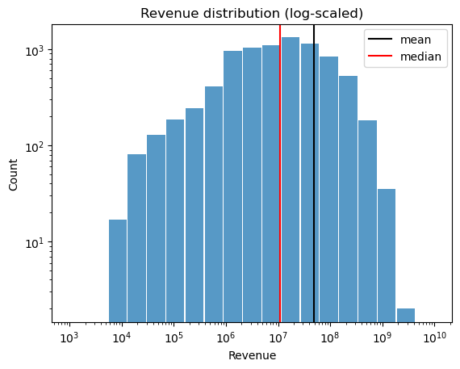
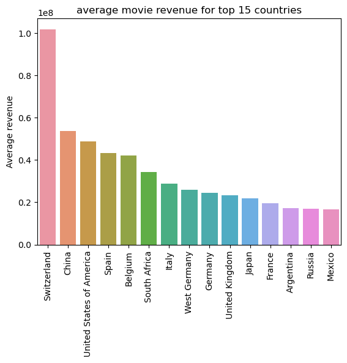
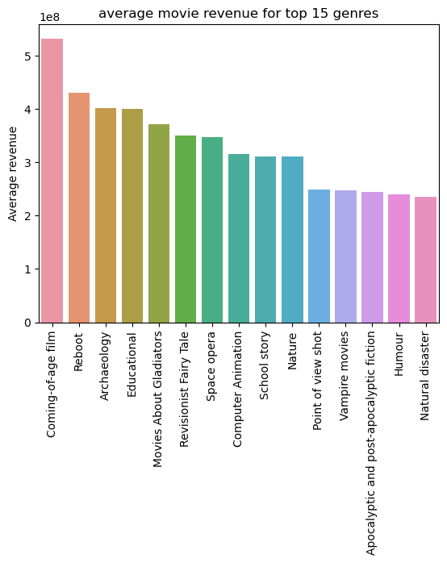

# Movie Company: How to increase the revenue?

| Student's name | SCIPER |
| -------------- | ------ |
|Yifei Song |335187 |
|Haoming Lin |351632 |
|Grave de Peralta Gonzalez Rolando  |362607 |
|Ruiqi Yu |340546 |

## Abstract

The global film industry market size can be up to two hundred billion USD every year, which is a big part of the economy, and proper data analysis can benefit its growth.
For investors, the level of box office is the criterion for the success of the movie, and the correct predictions of revenue help the better allocation of investment capital and higher income of the film industry.

Our goal is to study some factors(movie country, language, genres, characters, etc.) related to film revenue and then use the conclusions to create a rough forecasting model for movie revenues, which will help potential investors have a better understanding of film revenue not only in the past but also in the future.
In our data story, readers can understand what and how impacts film revenue, and the development track of film in the past and future.

## Research Questions

- How do the factors influence the film revenue?
- What is the expectation of a new movie revenue given the aforementioned factors' information?
- What are the hottest, or most recurring, topics in the film industry in the past decades?
- How will the trend of the film industry change in the coming period?

## Proposed additional datasets

- [Name Corpus](https://www.kaggle.com/datasets/nltkdata/names?resource=download) - a dataset containing male and female names, which is used to remove common English names when we do plot summary topic analysis tasks. High-frequency English names are similar to stopwords in text analysis. In order not to have people's names without real meaning in the analysis results, we need to remove them from the text in the pre-processing stage.

## Methods

### Data Pre-processing

#### Revenue Processing

We take into account that income is not the same as an indicator such as a score, but its value fluctuates depending on the era, country and special events, which means that economic activities such as inflation have to be taken into account. Therefore, we created a new column "Revenue_ratio", which represents the percentage of a movie's revenue in the total box office revenue of the year. This can reduce the difference in revenue due to inflation to a certain extent.

#### Plot Summary Processing

We treat all the plot summary data as a two-dimensional list, and the plot summary of each movie is a list on the second dimension.

To extract the topic of the movie through the analysis of the movie plot summary, we do the following processing of the movie plot summaries:

- Tokenization - Split the plot summary into the smallest unit of word, "token".
- Stopwords - Remove punctuation symbols, special characters and common words.
- Name Removing - Remove all common English names in our plot summary by using the additional dataset \<Name Corpus\>.
- Dictionary and corpus creation - Create word dictionary with our filtered tokens and create corpus by using [TF-IDF](https://fr.wikipedia.org/wiki/TF-IDF#:~:text=Le%20TF%2DIDF%20(de%20l,dans%20la%20fouille%20de%20textes)).

### Overview of Different Factors
Movie revenue could be affected by different factors, such as language,  the country in which the movie is released, and actors taking part.
By dividing the data into different subgroups according to different values of a feature, we show a difference in movie revenue in these subgroups.

Further analysis will focus on the statistical significance of these differences.
Secondly, there are certainly some features we can extract from actors of a movie.
However, according to our preliminary analysis, the impact of such factors on the revenue is not yet clear.
For further analysis, we will consider combining different factors instead of looking at them separately one by one.
Some simple machine learning models, such as linear regression, and tree-based methods may be used in this case.
Since these simple models are also interpretable, much more detail related to the importance of different factors could also be deduced from them.

#### Preliminary results

The distribution of the movie revenue is highly skewed, as expected.
But the most important information to retain is
the mean: $4.84\times10^7$ and the median: $1.09\times10^7$.

We group movies by their release country, ignoring those released in more than two countries.
And by computing the average movie revenue for every country, the top 15 are shown as follows.

The top 12 (until France) has an average revenue of more than $2\times10^7$, which is twice the median revenue overall.
The average movie revenue in Switzerland is the highest, twice the average in China, how can we explain this difference?
And what can we draw from that?

We did the same thing for different genres.
Except for this time, the same with different genre tags will be taken into account for each of these genres.
The top 15 are shown in the following barplot.

These averages seem to be much higher than the median value overall, and the top 1 "coming-of-age film" is high than the mean overall( $4.84\times10^7$ ).
The natural question we can ask is: are these factors statistically significant enough to explain the difference in revenue, or it is only due to the randomness of data?
And many hidden variables may exist leading to such a result here, actors could be one of them.
In addition, the same genre may be received differently in different countries and in different eras.
These will lead us to further analysis.

### Hottest Word in Movie Title

We would like to know which words appear in high frequency in all the movie names. This can reflect the trend of movie naming and the underlying movie topic.

<u>In further research, we will also examine whether the naming style of the films changed from period to period.</u>

#### Preliminary result

We make a **wordcloud** with all movie names, which indicates the hottest words.

### Topic Retrieval

Since the plot summary is an unlabeled dataset, we decide to use **LDA**(Latent Dirichlet allocation), an unsupervised learning algorithm, to implement topic retrieval and analysis.

#### LDA Detail

LDA is to find topics a document belongs to, based on the pre-processed words in it:

- Go through each document and randomly assign each word in the document to one of $k$ topics ($k$ is chosen beforehand).

- For each document $d$, go through each word $w$ and compute :

  - $P(t|d)$ : the proportion of words in document $d$ that are assigned to topic $t$.

  - $P(w|t$) : the proportion of assignments to topic *t* over all documents that come from this word *w*. Tries to capture how many documents are in topic $t$ because of word $w$.

  - Update the probability $P(w, t)$ with 

    $P(w,d) = P(t|d) *P(w|t)$

#### Preliminary results

<u>In milestone 2, we used only a partial sample for preliminary testing. We will make further refinements and adjustments in the final version.</u>

- Direct output: We obtained the k most relevant topics, along with the keywords in each topic and their scores.

  

- Visualization: We get more intuitive dynamic results with the help of the **pyLDAvis** package. (This result is not directly displayed on github, due to the dynamic image)

  

## Proposed timeline

- Week 10: Data Treatment(filtering, exploring the dataset)
- Week 11: Initial Analyzation (Simple calculation and NLP treatment on the datasets)
- Week 12: Further Analyzation (Training the prediction model) and Start to set up our website
- Week 13: Data Visualization and Text Writing in the website
- Week 14: Finalization of the project

## Organization within the team:

- Yifei Song: Data Pre-processing, Plot Summary Analyzation with LDA, Trend Prediction, Data Visualization
- Haoming Lin: Data Pre-processing, Factors Significance Analyzation, Data Visualization
- Grave de Peralta Gonzalez Rolando: Website Design, Story-telling Writing, Data Visualization
- Ruiqi Yu: Initial Analyzation, Movie Name Analyzation, Data Visualization, Story-telling Writing
